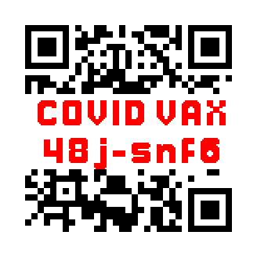
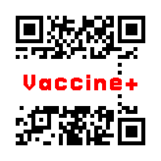
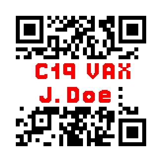
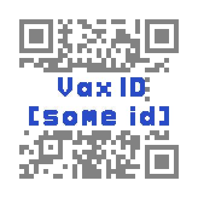

# Vaccine Passport/Acknowledgement Proposal

1. Human Readable
2. Easily recognizable
3. Memorable domain
4. Not easily counterfeit - the displayed text is encoded into the url and can be verified, it is **not** error-corrected like most QR codes with media in the middle of them 

Some potential options:

I don't know anyone in the CDC/HHS/vaccine distribution area, but if you know someone who knows someone, please pass this along.